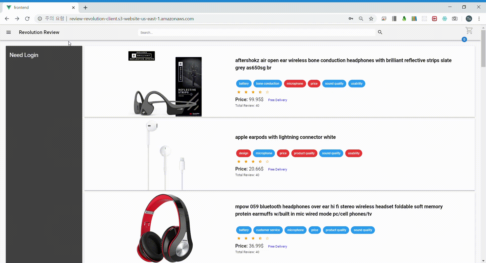

# 2019fall_42class_team4

# Review Revolution

### 저희는 **신개념 사용자 리뷰 비교,분석 서비스 시스템 in 웹 쇼핑몰**을 만들고 있습니다.

## **Team Member**

## - 윤성경
## - 정창호
## - 유종현
## - 김진태

# DEMO VIDEO #

### DEMONSTRATION:

Reference 사이트인 AMAZON과 비교한 ReviewRevolution의 쇼핑 편의성 
### :> 상품과 리뷰에 키워드 tag가 붙어서 한눈에 보기 쉽다.
### :> 상품을 비교하는 부분에서, 단순 SPEC만이 아닌, 사용자들의 경험에서 나온 느낌들을 리뷰와 키워드를 통해 비교할 수 있다.
- **AMAZON**

- **REVIEW REVOLUTION**

### SCENARIO: 

1. 회원가입

2. 로그인

3. 개인정보 변경 (키워드 변경, 비밀번호 변경)

4. 상품 검색

5. 유사 상품 비교, 선택

6. 리뷰 Navigation (평점순, 최신순, 키워드 포함 조건)

7. 상품 구매 + 내가 구매한 상품 목록 보기 + 상품 삭제

8. 리뷰 작성 + 리뷰 삭제

9. 리뷰 추천, 추천 취소 + 내가 추천한 리뷰 목록 보기 

### 진행상황 
### - 구현 완료, 백엔드는 AWS EC2, 프론트엔드는 AWS S3에 배포 완료. (2019/12/8)
### - 프론트엔드 접속 주소 : http://review-revolution-client.s3-website-us-east-1.amazonaws.com (2019/12/8 기준)
### - design specification 완료 (2019/11/12)
### - design specification 4차 checkpoint : Testing Plan, State Diagram, Package Diagram 보완 (2019/11/12)
### - design specification 3차 checkpoint : Protocol, Database Design 작성 (2019/11/09)
### - design specification 2차 checkpoint : preface, introduction, testing plan, development plan outline 작성 (2019/11/08)
### - design specification 1차 checkpoint : System architecture overall, frontend, backend 작성 (2019/11/06)
### - requirement 완료 (2019/11/03)
### - requirement 4차 checkpoint : 전체 프로젝트 확인, 비교 및 feedback (2019/11/03) 
### - requirement 3차 checkpoint : appendix 전까지 (2019/11/03)
### - requirement 2차 checkpoint : system requirement까지 (2019/10/31)
### - requirement 1차 checkpoint : user requirement까지 (2019/10/30)
### - proposal 마지막 수정 (2019/10/19)
### - proposal 완료 (2019/10/11)
